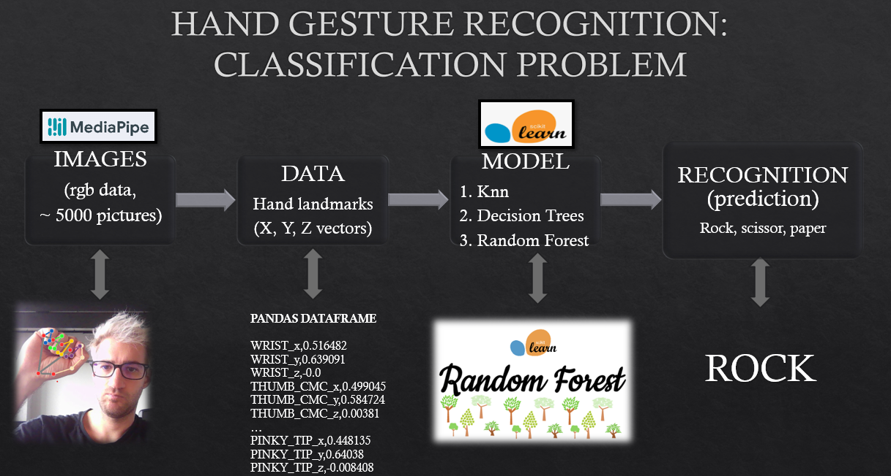

# 1) ROCK SCISSOR PAPER WITH ML AND MEDIAPIPE 
(IRONHACK DATA ANALITICS BOOTCAMP'S FINAL PROJECT)
## Play rock scissor paper inputing the move through the camera
### Description
#### I trained ML classification alghorithms in order to recognize rock, scissor or paper through the camera. By showing your hand-move to the camera, it will recognize wich move you current move. 
[insert video]

### How 
#### I used Mediapipe API to transform video-frames into landmarks. This translates every image/frame into a group of coordinates. In order to train the model, I asked people to send me videos of them doing rock, scissor and paper (separatly), that then I translated in coordiantes with Mediapipe. This gave me classified groups of data that I used to train various ML models. Aftern training them, I uploaded in Toocudesigner, This allows me to transform every frame (ideally, it runs at 5fps) into an information: rock, scissor or paper.

### Game 
#### I created a basic game as a demo. By toggling GameMode "ON", you can play rock, scissor, paper against the CPU (CPU moves are random). Since the move-recognition is not 100% perfect, to actually input your move you need to keep it stand for a few seconds (showed by the colored bars in the left-top). 
Enjoy!

[insert video]

# FIRST PROJECT 
## Scatterplot generator with Touchdesigner
### The projcet contains a scatterplot generator in a touchdesigner file. Without any cooding needed, you only need to upload a csv file, write down the x and y variables, and it's done. 
Plus, it contains many more features, good both for data visualization and data exploration. 
[insert fig]
#### 1) Outliers 

### website
https://tommella90.github.io/Tommy_Portfolio/

